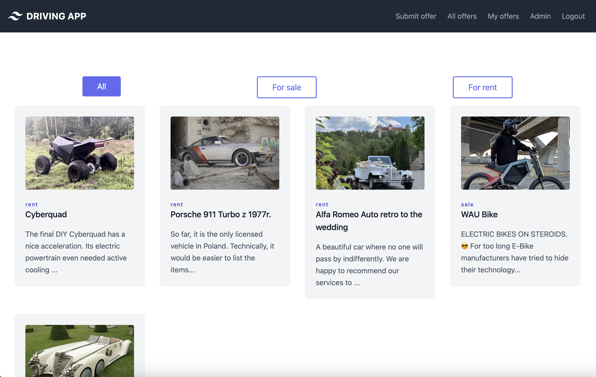
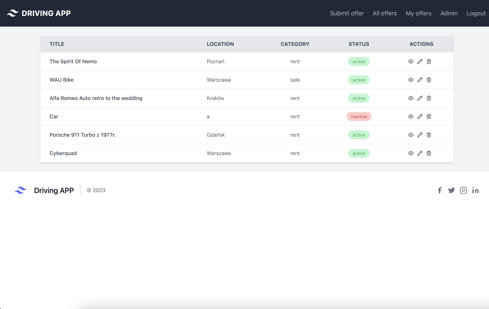

# Driving APP

## General info

Project created with an online course using React and Next.js. Thanks to the creation frontend and backend of the project, I gained more knowledge about connect to database, creat endpoints, Airtable, micropayments with Stripe, Tailwindcss and Cloudinary.

#### Aplication description

Search for all types of car rentals near you, including sailing cars, quads and luxury motorbikes.

## Technologies

- ReactJS 18.2
- Next.js 13.4 (+ SWR)
- NextAuth.js 4.22
- Tailwind CSS 3.3
- Airtable
- Stripe (webhooks and ngrok)
- Cloudinary
- Nodemailer

## Website

[Driving APP - website](https://driving-app-next-js.vercel.app/)

## Features

- Adding, editing and deleting offers by the author and admin.
- Sorting offers (All / For sale / For rent)
- Administration panel
- Payment service by Stripe
  - Added support for Stripe webhooks
- Uploading photos to Cloudinary
- Reset password and send an email

## Illustrations

  

